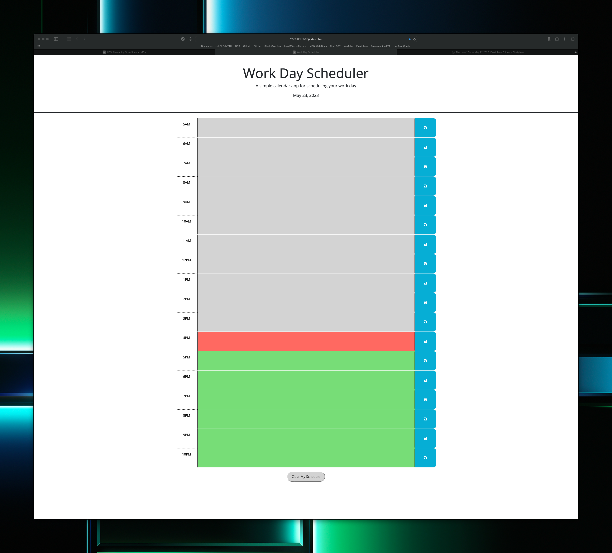

# Work Day Scheduler

This repository contains a simplified and effective work day scheduler application. It offers users the ability to record their tasks in hourly blocks, making it easy to manage their time throughout the workday.

## Features

- **Hourly time-blocks:** The scheduler accommodates a wide range of hours, starting from 5 AM and ending at 10 PM, offering scheduling opportunities for both early birds and night owls.
- **Color-coded blocks:** The scheduler offers color-coded blocks that visually indicate whether a block of time has passed (gray), is currently active (red), or is yet to come (green).
- **Task persistence:** The tasks you enter will be stored in your browser's local storage. This means that your tasks will remain available even after you close the browser.
- **Clear schedule:** A "Clear My Schedule" button is available to clear all your tasks at once, offering a clean slate whenever needed.

## Usage

To use the Work Day Scheduler, simply load the webpage and click on the text area within the hourly blocks to input your tasks. When you've finished entering a task, click the save button to store the task in your local storage.

You can also use the "Clear My Schedule" button located in the footer to clear all your tasks.

## Technologies Used

- HTML5
- CSS3
- JavaScript (jQuery)
- Bootstrap
- Day.js

## Possible Future Updates

- **Responsive Design:** The scheduler could be made more responsive to accommodate various screen sizes and devices.
- **Multi-day Scheduling:** Expand the scheduler's capabilities to include multiple days or weeks.
- **Task Notifications:** A feature to set reminders or notifications for upcoming tasks.
- **Share schedule:** A feature that allows users to share their schedule on social media platforms or email.

## Link to Deployed Application

[Work Day Scheduler](link-to-your-deployed-application)
